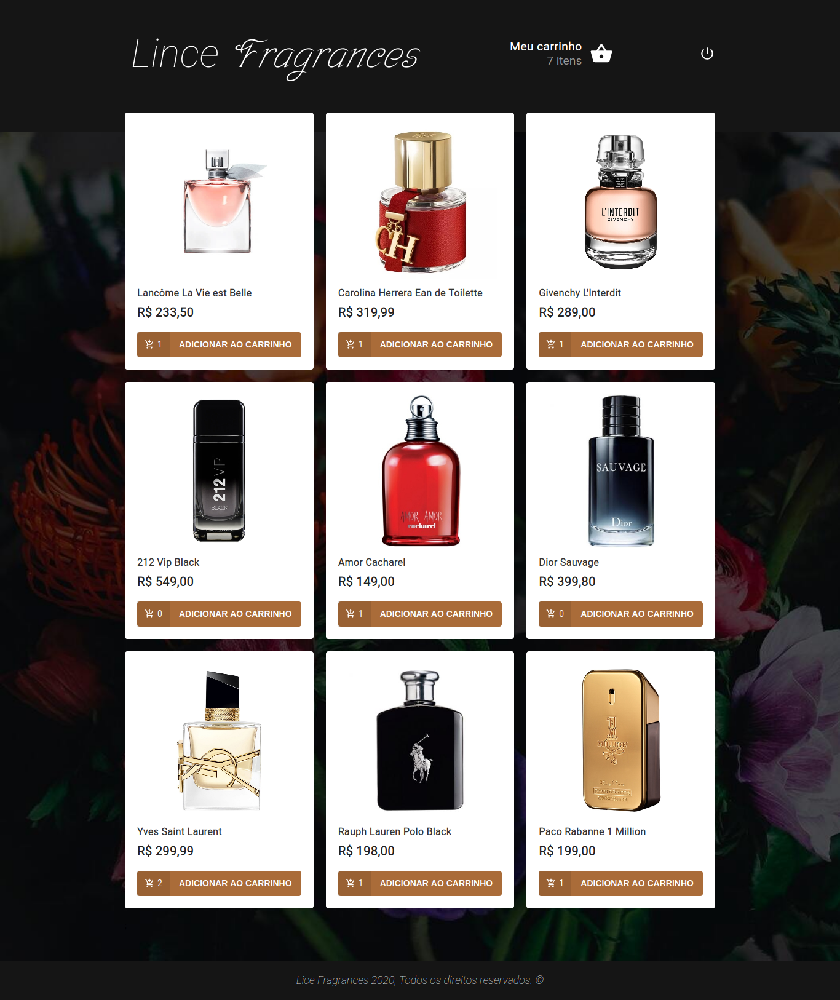

# contact-keeper

## Project

***EN:*** This project is a Full Stack MERN Application that an user register an account and will be able to create and keep contacts  with some informations like name, email, phone number, personal or professional contact and also filter, update or delete them. It was developed with the aim of studying the React JS library during the React Front To Back course, taught by Brad Traversy.

***PT-BR:*** Este projeto é um aplicativo MERN Full Stack em que um usuário registra uma conta e poderá criar e manter contatos com algumas informações como nome, email, número de telefone, contato pessoal ou profissional e também filtrá-los, atualizá-los ou excluí-los. Foi desenvolvido com o objetivo de estudar a biblioteca React JS durante o curso React Front To Back, ministrado por Brad Traversy.

## Technologies

This project was developed with the following technologies:

- HTML
- CSS
- ReactJS
- NodeJS
- Express
- MongoDB
***

## Preview

***

## How To Install

In the project directory, run:

### `npm install`
#### Install backend API with all dependencies.    

And in the project directory, access the client folder and then run:

### `npm install`
#### Install react app with all dependencies.    

And finally run the command in the project directory (not in the client folder):

### `npm run dev`
#### Runs the backend API and the react app concurrently in the development mode.    

## License

This project is under the MIT license.

